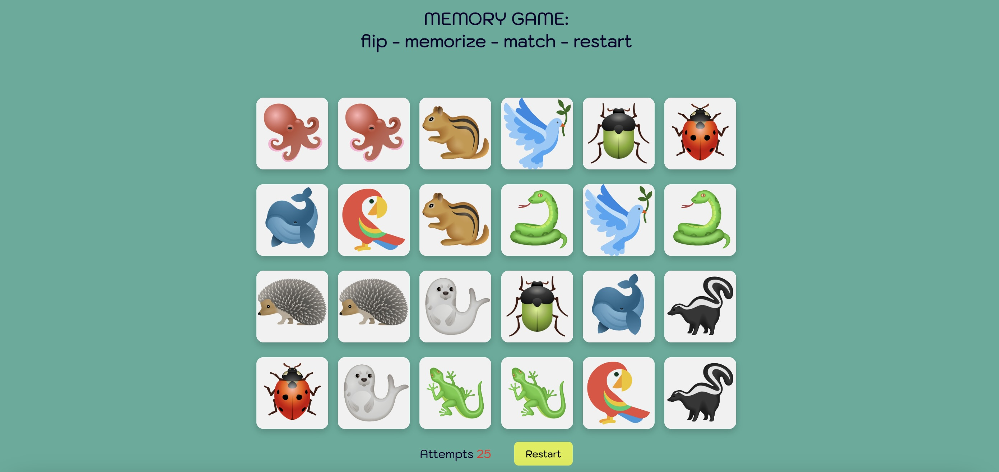
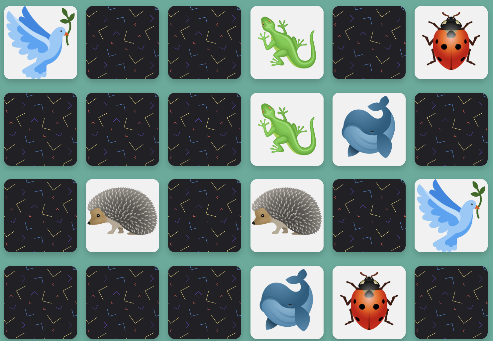
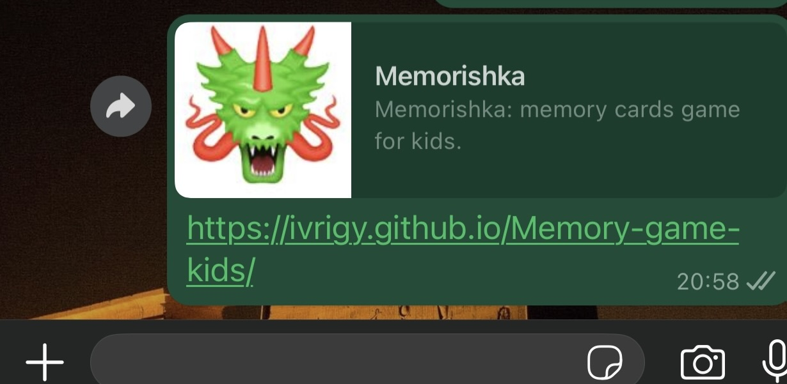
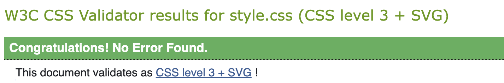
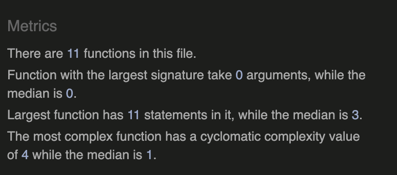

# Memorishka
### Simple memory card game for children

Memorishka game is made for kids but it can also be useful for people of all other ages as a great tool to enhance visual memory and concentration. The game can be played by one or more players (if so then recommended on iPad).The object of the game is to turn over all pairs of matching cards.

## Scope

Built using HTML, CSS, and JavaScript, the scope of this project focuses on providing a simple, engaging interface that children can easily interact with on both desktop and mobile devices. Focus was on Javascript and in order to enhance my practice I scoped my project too high for knowledge I was able to attain spending extremely hong hours reading (unfortunately long amount of text instead watching a teacher explain!) and practicing assignments. So the first MVP scope that had 3 difficulty levels turned to be too much for me so i went for the AMVP (A as in Absolute.) I focused on elementary features and created following user stories.  

## User Stories

As a child: I want a simple memory game that I can easily understand and do
As a child: I want game to be fun and colorful
As a child: I want a fun and friendly competition to see who can turn more cards

## Features
As a fully minimalistic game with the main focus on the user needs, this project also had basic and minimalistic features. 

### Heading 

As the AMVP is focused on the game itself the heading of the website is also minimalistic simultaneously aiming to address the Title and bring super minimalistic explanation of how to play the game. As part of my users are still not able to read, but for probably have played  same game in physical form, whole section is modelled to that. 

### Game and Cards

I wanted to create a simple, colorful interface that immediately draws children’s attention to the game container. Each card contains engaging images or patterns that correspond to second user story. Images of animals are graphical what also corresponds with age of the main user. 

### Buttons and actions

This section of the game’s interface displays two different functions that the game offers. The score counter provides immediate feedback by tallying how many attempts a player has made while searching for matching card pairs, encouraging a more strategic approach to each flip. I decided to include only this function, without a timer, as a timer can put too much pressure on kids. The Restart button, prominently displayed, allows for a swift reshuffle and a full game reset, granting players an instant do-over whenever they want to refine their strategy or simply start fresh. This part of the interface is designed with contrasting colors and clear typography, helping children quickly see their progress and easily restart the game if they wish to try again.

### Favicon

The dragon favicon exudes both playfulness and a hint of mystery, perfectly capturing the spirit of Memorishka. Its vivid green hue and whimsical design invite players into a realm where imagination meets memory skills, instantly signaling a fun yet engaging experience. 

### Future feature
I would definitely love to add difficulty levels to the game—not just by increasing the number of cards, but also by introducing more challenging images that don’t differ much from one another. This is something I plan to work on in the future.

## UX/UI Design

### Colors

The game uses a simple yet vibrant color palette centered around three main colors—teal, black, and white—with a playful accents on yellow, red, green and blue sprinkled into the card back design but also visible on images.Teal background serves as a calm and inviting backdrop that keeps the focus on the cards. Card back offers a fun contrast to the teal background, making it easy to spot which cards are still face-down. On card fronts animal images and colors (like the green gecko, red ladybug, or blue whale) mirror and complement the accent hues, creating a cohesive visual experience. White backgrounds on cards enable image to be distinctive. By contrasting black and white on the two sides of the cards, children can quickly tell which side is face-up. 

### Typography

Clear, child-friendly font to ensure easy readability.

### Wireframes

Initial sketches or mockups designed to visualize the layout and flow. As i work with figma my wireframes are a bit more toward high fidelity but as i am learning to code here I look not to design in advance. More u can find in this folder: [Wireframes](docs/wireframes/)

### Responsive Design

Using responsive design in code is a whole new game to me. I am really trying to stay innocent and not produce design codes so responsive coding is a long learning path I should walk every day in order to prepare for PP5.  

## Testing

### Manual testing

Tested by me and 4 other users. Checked flipping functionality on various browsers and screens. Tested the reset button to ensure it reshuffles and resets the game state correctly.Ensured images load properly. Testing pictures you can find here: [Test](docs/tests/)

### Validation

Double-checked everything, and all the results were positive.

Double-checked everything, and all the results were positive.

Went through 3 times until code was cleaned according to suggestions

### Bugs

OMG! I am absolutely sure coding and programming should be renamed in bugging or buging, not sure which one would be more “grammatically’ correct as I know now grammar is a part of assessment criteria. But bugs are a whole essence of coding. They crawl, scratch, bite, infect and keep you awake when everyone else is asleep. I had many of them in this project and probably many have until I die. And I hate insects although B.Gates says we should start eating them. PFUI! And also the most important message here to be understood is SEI KEINE ZEKE! 

## Unresolved bugs

I got feedback from Lighthouse and realised that images on the cards have no alt. As images are created through DOM in Javascript that is something I would need to additionally learn how to do. So, this will fall out from this scope. 
## Deployment

The site was deployed using GitHub pages.
The steps to activate Github pages are as follows:
- Navigate to the settings tab in the GitHub repository.
- In the settings, navigate to the "Pages" tab on the left of the page.
- In the "Build and deployment" section, select "Deploy from a branch" in the source dropdown.
- Select the branch "main" and click on "Save".
Link: [Memorishka](https://ivrigy.github.io/Memory-game-kids/)

## Credits

God bless all the bros out there on YouTube recording coding videos and explaining every single line! Without you, we’d be stuck staring at CI course lessons like deer in headlights. Your step-by-step breakdowns and goofy side comments are reason that my sanity is still there after 2 nervous breakdowns as this course is NOT meant for people like me who have ADHD and dyslexia.  There are many of you but for this project I was inspired by codes of : [Online Tutorials](https://www.youtube.com/watch?v=M0egyNvsN-Y) and [JS Academy](https://www.youtube.com/watch?v=xWdkt6KSirw)

Also shout out to high level patern design by [Pattern monster](https://pattern.monster/)

All pictures downloaded and licensed by [Envato](https://elements.envato.com/)

The fonts are imported from [Google Fonts](https://fonts.google.com/)

## Thanks
I would like to thank to:
- My child and my parents for 100% support during this slightly User Unfriendly CI program structured to exclude neurodivergent people like me. My family is amazing in tolerating over hours I spend to learn coding so I can bootstrap my startup. I love you so much!
- My mentor, Sheryl for supporting and understanding hardships I go through. 

Enjoy the game!
