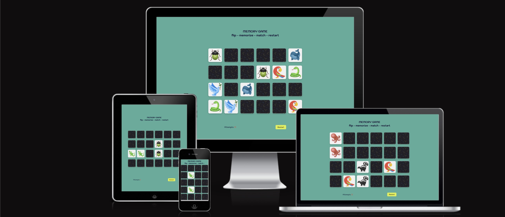

# Memorishka
### Simple memory card game for children

Memorishka game is made for kids but it can also be useful for people of all other ages as a great tool to enhance visual memory and concentration. The game can be played by one or more players (if so then recommended on iPad).The object of the game is to turn over all pairs of matching cards.

## Scope

Built using HTML, CSS, and JavaScript, the scope of this project focuses on providing a simple, engaging interface that children can easily interact with on both desktop and mobile devices. Focus was on Javascript and in order to enhance my practice I scoped my project too high for knowledge I was able to attain spending extremely hong hours reading (unfortunately long amount of text instead watching a teacher explain!) and practicing assignments. So the first MVP scope that had 3 difficulty levels turned to be too much for me so i went for the AMVP (A as in Absolute.) I focused on elementary features and created following user stories.  

## User Stories

As a child: I want a simple memory game that I can easily understand and do
As a child: I want game to be fun and colorful
As a child: I want a fun and friendly competition to see who can turn more cards

